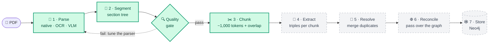
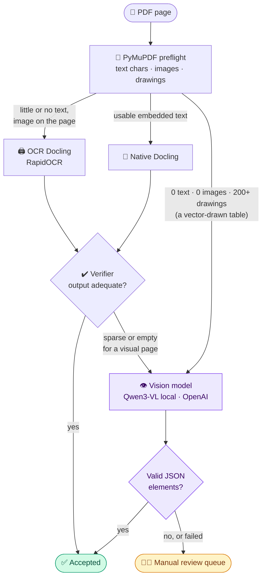

<div align="center">

# 🕸️ Knowledge Graph for Unstructured Data

### Messy PDFs in. A clean, cited knowledge graph out.<br>Every page gets the cheapest parser that works, and every fact keeps its page number.

<p>
  
  
  
  
  
  
</p>

**[🧩 The problem](#-the-problem)** · **[🗺 Big picture](#-the-big-picture)** · **[🧭 Page router](#-how-each-page-finds-its-parser)** · **[🚀 Quickstart](#-quickstart)** · **[📚 Commands](#-command-reference)**

</div>

<p align="center">
  <a href="https://buymeacoffee.com/karthiaienq"></a>
  <br/>
  <a href="https://buymeacoffee.com/karthiaienq"></a>
</p>

<br>

| 🧭 **3 parsers, 1 router** | 🔍 **Verify, then trust** | 🧾 **Full provenance** | 🌳 **Structure first** |
|:---:|:---:|:---:|:---:|
| native text, OCR or a vision model, chosen per page | every page's output is checked before it is accepted | page, bounding box and section on every element | a section tree from the PDF outline before any chunking |

---

## 🧩 The problem

Ask a language model to pull facts out of a long PDF one chunk at a time, and it loses the thread:

```text
📄 Page 120   "Gluconeogenesis is the synthesis of glucose from non-carbohydrate precursors."
📄 Page 121   "It is inhibited by insulin."
                ▲
                └── a chunk that only sees page 121 has no idea what "It" is
```

The result is a graph full of orphan pronouns, duplicate nodes, and labels that change from chunk to chunk.
This project fixes that **from the bottom up**: parse every page correctly, rebuild the document's structure,
then chunk with overlap and section context, so the later extraction steps always know where they are.

> 💡 Before any of that, the PDF itself has to be read correctly. Real documents mix born-digital text, scanned
> pages and vector-drawn tables, and no single parser handles all three well. That is what Stage 1 solves.

---

## 🗺 The big picture



<sub>🟩 built and validated · ⬜ dashed = designed, coming next</sub>

| Stage | What it does | Script | Status |
|---|---|---|:---:|
| 🧭 **Parse** (Phase 1A) | Routes each page to native Docling, OCR, or a vision model, and verifies the result | `stage1a_hybrid_vlm_parse.py` | ✅ |
| 🌳 **Segment** (Phase 1B) | Builds the chapter / section tree from the PDF outline and pins every element to a section | `stage1b_structural_segment.py` | ✅ |
| 🔍 **Quality gate** (Phase 1C) | Five checks on the segmented output, with a pass / fail report | `stage1c_quality_gate.py` | ✅ |
| ✂️ **Chunk** (Phase 2) | Token-budgeted chunks with a raw overlap tail and section breadcrumbs | `stage2_semantic_chunking.py` | ✅ |
| 🧠 **Extract** | One structured-output call per chunk, with a fixed ontology and a running entity memory | | 🔜 |
| 🔗 **Resolve** | Embedding + string similarity to merge the same entity across chunks | | 🔜 |
| 🌐 **Reconcile** | A second pass over the extracted graph, not the raw text | | 🔜 |
| 🕸️ **Store** | Neo4j (or networkx) with page and chunk provenance on every edge | | 🔜 |

---

## 🧭 How each page finds its parser

The vision model is the slowest and most expensive route, so it is a **targeted fallback**, never the default.
PyMuPDF measures every page first, the cheap parsers go first, and a verifier decides whether their output is good enough.



| Route | Best for | Why |
|---|---|---|
| 📝 **Native Docling** | born-digital pages | fast, keeps headings and table structure |
| 🖨️ **OCR Docling** | scanned or rasterized text pages | RapidOCR (Torch backend) only where it is needed |
| 👁️ **Vision model** | diagrams, charts, maps, image-only or vector-drawn tables | reads what text extraction cannot; renders the page to PNG and asks for structured JSON |
| 🧑‍🔧 **Manual review** | anything the others could not read | a failed or malformed answer is **never** accepted |

> 🛡️ **No page silently disappears.** The run writes a manifest with exactly one final route per page, the reason
> for it, and, for vision pages, the provider, model, latency, tokens per second and the evidence PNG.

---

## 🔍 The Phase 1C quality gate

Run it before chunking: it checks the segmented output and writes a pass / fail report.

| Check | Catches |
|---|---|
| 🧾 **Provenance** | an element without `page_num`, `section_id` or `element_id` |
| 🔤 **Text reconstruction** | long CamelCase-style word joins such as `MainExamination` |
| 🌳 **Section tree** | sections without a stable ID, title or page range |
| 📊 **Table duplication** | a table that also leaks into the body as loose text |
| ↕️ **Reading order** | an element that jumps back to an earlier page |

---

## ✂️ Chunking with memory

```text
 ┌──────────── chunk_0001 · ~1,000 tokens ────────────┐
 │ ¶ ¶ ¶ ¶ ¶ ¶ ¶ ¶ ¶ ¶ ¶ ¶ ¶ ¶ ¶ ¶ ¶ ¶ ¶ ¶ ¶ ¶ [tail] │
 └────────────────────────────────────────────┬───────┘
                                              │ last 150 tokens, raw
                                              ▼
                                     ┌── prev_chunk_tail ──┬──────── chunk_0002 ────────┐
                                     │ "…synthesis of      │ ¶ "It is inhibited by       │
                                     │  glucose from…"     │    insulin." ¶ ¶ ¶ ¶ ¶      │
                                     └─────────────────────┴────────────────────────────┘
```

- Whole elements are packed into a token budget (default **1,000**, `cl100k_base`), so a paragraph or table is never cut in half.
- Each chunk carries the **raw tail** of the previous one (default **150** tokens), with no extra model call, so "It" can be resolved.
- Each chunk also records its **page range**, **section ID** and **breadcrumb** (`PART III › 22. Parliament › …`).
- Tables are serialized row by row, with cells cleaned and pipes escaped.

---

## 🧪 Tested on a real book

The pipeline was built and validated on a **1,407-page Indian polity textbook**:

| | |
|---|---|
| 📑 PDF outline | 119 entries → **121 sections** (plus a document root and front matter) |
| 📝 Native run, pages 4–20 | 17 pages, 141 text elements, 7 tables, 0 warnings, in about 46 s on CPU |
| 🖨️ OCR run, pages 1–3 | 3 scanned pages detected and read, 0 warnings |
| 🧭 Routing plan for the whole book | pages 1–3 → OCR, pages 4–1,407 → native |
| 🧪 Unit tests | 18 tests: routing, the verifier, retries on bad JSON, strict JSON schema, gateway config |

---

## 🛠️ Tech stack

| Layer | Choice |
|---|---|
| Parsing | **Docling** (tables, heading hierarchy, OCR) as the source of truth |
| Preflight and QA | **PyMuPDF**: text, image and vector-drawing counts, PDF outline, page rendering |
| OCR | **RapidOCR** with the Torch backend, only on pages that need it |
| Vision fallback | **Qwen3-VL** through any OpenAI-compatible local gateway, or **OpenAI** (default `gpt-5-mini`) with a strict JSON schema |
| Chunking | **tiktoken** (`cl100k_base`) |
| Coming next | structured-output extraction, embedding-based entity resolution, **Neo4j** |

---

## 🚀 Quickstart

Run everything from the repository root in PowerShell.

```powershell
# 1. Set up
python -m venv .venv
.\.venv\Scripts\pip install -r .\unstructured_data\requirements.txt
Copy-Item .\.env.example .\.env      # only needed for the vision-model route; put real keys in .env only

# 2. Put a PDF in unstructured_data\Docs\, then preview the per-page routing (no parsing, no model calls)
.\.venv\Scripts\python.exe .\unstructured_data\pipeline\stage1a_hybrid_vlm_parse.py .\unstructured_data\Docs\my_book.pdf --plan-only

# 3. Parse (native / OCR / local vision model, decided per page)
.\.venv\Scripts\python.exe .\unstructured_data\pipeline\stage1a_hybrid_vlm_parse.py .\unstructured_data\Docs\my_book.pdf --provider local --progress-mode auto

# 4. Build the section tree
.\.venv\Scripts\python.exe .\unstructured_data\pipeline\stage1b_structural_segment.py .\unstructured_data\Docs\my_book.pdf .\unstructured_data\output\parsed

# 5. Run the quality gate
.\.venv\Scripts\python.exe .\unstructured_data\pipeline\stage1c_quality_gate.py .\unstructured_data\output\parsed my_book.hybrid_vlm

# 6. Chunk
.\.venv\Scripts\python.exe .\unstructured_data\pipeline\stage2_semantic_chunking.py .\unstructured_data\output\parsed my_book.hybrid_vlm
```

### 📦 What you get

Everything is written to `unstructured_data/output/parsed/` (git-ignored):

```text
my_book.hybrid_vlm.manifest.json              🧭 one final route per page, with the reason
my_book.hybrid_vlm.quality_report.json        📋 parse summary
my_book.hybrid_vlm.<method>.pXXXX-pYYYY.*     📝 Docling JSON, Markdown and page index per range
my_book.hybrid_vlm.vlm_elements.jsonl         👁️ elements read by the vision model
my_book.hybrid_vlm.pNNNN.png                  🖼️ evidence image for each vision-model page
my_book.hybrid_vlm.document.sections.json     🌳 the section tree
my_book.hybrid_vlm.document.elements.jsonl    🧾 every element, attached to a section
my_book.hybrid_vlm.segmentation_report.json
my_book.hybrid_vlm.quality_gate_report.json   🔍 the five checks
my_book.hybrid_vlm.document.chunks.jsonl      ✂️ chunks, ready for extraction
```

---

## 📚 Command reference

<details>
<summary><b>🧭 Phase 1A · Hybrid-VLM parser</b> (the main parser)</summary>

<br>

The local provider reads `VLM_LOCAL_BASE_URL`, `VLM_LOCAL_API_KEY` and `VLM_LOCAL_MODEL` (default `qwen3`).
Hosted OpenAI uses `VLM_OPENAI_API_KEY` and `VLM_OPENAI_MODEL`. See `.env.example` for every name.

Check the local gateway, list its models, or run a quick chat test before a long job:

```powershell
.\.venv\Scripts\python.exe .\unstructured_data\pipeline\stage1a_hybrid_vlm_parse.py .\unstructured_data\Docs\my_book.pdf --health-check-local
.\.venv\Scripts\python.exe .\unstructured_data\pipeline\stage1a_hybrid_vlm_parse.py .\unstructured_data\Docs\my_book.pdf --list-local-models
.\.venv\Scripts\python.exe .\unstructured_data\pipeline\stage1a_hybrid_vlm_parse.py .\unstructured_data\Docs\my_book.pdf --local-chat-smoke-test
```

Parse the first 30 pages with a per-page progress bar, elapsed time and vision-model token metrics.
The default cap is ten vision pages per run; `--max-vlm-pages 0` removes the cap (it does **not** send every page to the model):

```powershell
.\.venv\Scripts\python.exe .\unstructured_data\pipeline\stage1a_hybrid_vlm_parse.py .\unstructured_data\Docs\my_book.pdf --provider local --page-range 1 30 --max-vlm-pages 0 --progress-mode page
```

Force one page through the vision model, keeping normal routing for the rest:

```powershell
.\.venv\Scripts\python.exe .\unstructured_data\pipeline\stage1a_hybrid_vlm_parse.py .\unstructured_data\Docs\my_book.pdf --provider local --page-range 1 10 --force-vlm-page 6 --progress-mode page
```

Send only the selected pages to the vision model, skipping Docling and OCR:

```powershell
.\.venv\Scripts\python.exe .\unstructured_data\pipeline\stage1a_hybrid_vlm_parse.py .\unstructured_data\Docs\my_book.pdf --provider local --page-range 6 6 --vlm-only --max-vlm-pages 0 --progress-mode page
```

When the local model returns empty or malformed JSON, the parser retries once with a short JSON-only prompt and
5,000 completion tokens. Raise that limit for complex pages:

```powershell
.\.venv\Scripts\python.exe .\unstructured_data\pipeline\stage1a_hybrid_vlm_parse.py .\unstructured_data\Docs\my_book.pdf --provider local --page-range 6 6 --vlm-only --local-retry-max-tokens 6000 --progress-mode page
```

Use hosted OpenAI instead (this can cost money):

```powershell
.\.venv\Scripts\python.exe .\unstructured_data\pipeline\stage1a_hybrid_vlm_parse.py .\unstructured_data\Docs\my_book.pdf --provider openai --page-range 1 30 --max-vlm-pages 3 --progress-mode page
```

The direct vision route for vector-only pages (no text, no raster image, 200+ drawings) can be tuned with
`--direct-vlm-drawing-threshold NUMBER`.

</details>

<details>
<summary><b>📝 Phase 1A · Docling only and Hybrid OCR</b> (simpler parsers)</summary>

<br>

Docling alone, for a normal born-digital PDF (add `--ocr` for a scanned one; `--page-range` is inclusive and starts at 1):

```powershell
.\.venv\Scripts\python.exe .\unstructured_data\pipeline\stage1a_docling_parse.py .\unstructured_data\Docs\my_book.pdf --page-range 1 10
```

Hybrid OCR: native Docling for text pages, OCR only for pages that look scanned. Preview the split, then run it:

```powershell
.\.venv\Scripts\python.exe .\unstructured_data\pipeline\stage1a_hybrid_parse.py .\unstructured_data\Docs\my_book.pdf --plan-only
.\.venv\Scripts\python.exe .\unstructured_data\pipeline\stage1a_hybrid_parse.py .\unstructured_data\Docs\my_book.pdf
```

`stage1_parse.py` is the original PyMuPDF prototype, kept for quick inspection.

</details>

<details>
<summary><b>🌳 Phase 1B → 1C → 2</b> (segment, gate, chunk)</summary>

<br>

Phase 1B reads every `my_book.*.docling.json` and the vision elements in a folder, and builds the section tree from
the PDF outline (or from Docling headings when the PDF has no outline). An optional third argument sets the output folder:

```powershell
.\.venv\Scripts\python.exe .\unstructured_data\pipeline\stage1b_structural_segment.py .\unstructured_data\Docs\my_book.pdf .\unstructured_data\output\parsed
```

Phase 1C and Phase 2 take the folder and the `<pdf name>.hybrid_vlm` stem. Chunk size and overlap are adjustable:

```powershell
.\.venv\Scripts\python.exe .\unstructured_data\pipeline\stage1c_quality_gate.py .\unstructured_data\output\parsed my_book.hybrid_vlm
.\.venv\Scripts\python.exe .\unstructured_data\pipeline\stage2_semantic_chunking.py .\unstructured_data\output\parsed my_book.hybrid_vlm --chunk-size 1000 --overlap-size 150
```

</details>

<details>
<summary><b>🧹 Cleaning up generated output</b></summary>

<br>

Look first, then remove all generated files (keeps the tracked `.gitkeep`, your PDFs, code and `.env`):

```powershell
Get-ChildItem -LiteralPath .\unstructured_data\output\parsed -Force
Get-ChildItem -LiteralPath .\unstructured_data\output\parsed -Force | Where-Object { $_.Name -ne '.gitkeep' } | Remove-Item -Recurse -Force
```

Remove the output of one document only:

```powershell
Get-ChildItem -LiteralPath .\unstructured_data\output\parsed -Force | Where-Object { $_.Name -like 'my_book.*' } | Remove-Item -Recurse -Force
```

</details>

<details>
<summary><b>🧪 Running the tests</b></summary>

<br>

```powershell
.\.venv\Scripts\python.exe -B -m unittest unstructured_data.tests.test_stage1a_hybrid_vlm_parse -v
```

</details>

---

## 🗂️ Project layout

```text
Knowledge-Graph-for-Unstructured-Data/
├── .env.example                      # variable names for the vision-model providers (no real keys)
└── unstructured_data/
    ├── Docs/                         # your source PDFs
    ├── pipeline/
    │   ├── stage1a_hybrid_vlm_parse.py   # 🧭 router + verifier + vision fallback
    │   ├── stage1a_hybrid_parse.py       # native / OCR split
    │   ├── stage1a_docling_parse.py      # Docling only
    │   ├── stage1_parse.py               # original PyMuPDF prototype
    │   ├── stage1b_structural_segment.py # 🌳 section tree
    │   ├── stage1c_quality_gate.py       # 🔍 five checks
    │   └── stage2_semantic_chunking.py   # ✂️ chunks with overlap
    ├── tests/                        # unit tests for the hybrid parser
    ├── notes/PIPELINE_DESIGN.md      # 📐 the full design, stage by stage
    └── output/parsed/                # generated artifacts (git-ignored)
```

The full design, including the extraction prompt, ontology and entity-resolution plan, is in
[`unstructured_data/notes/PIPELINE_DESIGN.md`](unstructured_data/notes/PIPELINE_DESIGN.md).
