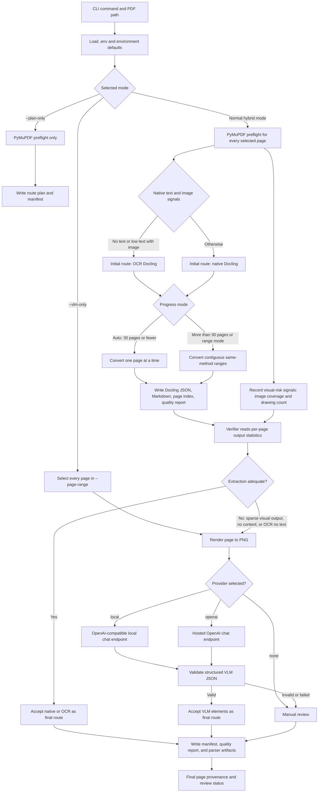
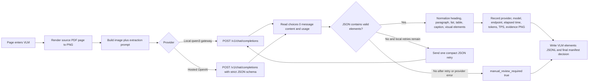

# PDF → Knowledge Graph Extraction Pipeline — Design

## 1. Goal

Take a source document (PDF, e.g. a textbook), and produce a knowledge graph
(entities + typed relationships) that:

- correctly resolves pronouns, abbreviations, and references that span pages/sections,
- does not fragment the same real-world entity into multiple nodes,
- uses a consistent, bounded vocabulary of entity/relation types (not a different
  label invented per chunk),
- keeps provenance (page/section) for every extracted fact.

## 2. Core problem being solved

LLMs extracting triples from independent chunks lose cross-chunk context:

```
Page 120: "Gluconeogenesis is the synthesis of glucose from non-carbohydrate precursors."
Page 121: "It is inhibited by insulin."
```

A chunk containing only page 121 cannot resolve "It". The pipeline below fixes this
with overlap, hierarchical context, a running entity memory, and a second
reconciliation pass over the extracted graph itself (not the raw text).

## 3. Architecture overview

```
PDF
 │
 ▼
[1] Document Parser        → structured text/markdown + page map
 │
 ▼
[2] Structural Segmentation → chapter / section / subsection tree
 │
 ▼
[3] Semantic Chunking       → overlapping, section-bounded chunks + metadata
 │
 ▼
[4] Context-Aware Extraction → per-chunk LLM call → local triples (JSON)
 │        (section title + prev-chunk tail + active entity memory + ontology)
 ▼
[5] Cross-Chunk Entity Resolution → dedupe/merge entities across chunks
 │
 ▼
[6] Global Graph Reconciliation   → LLM pass over the graph, not raw text
 │        (resolve indirect references, merge remaining duplicates)
 ▼
[7] Graph Storage           → Neo4j (or in-memory) with full provenance
```

## 4. Pipeline stages

### Stage 1 — Document Parsing

Use a layout-aware parser as the source of truth. The parser must preserve
reading order, paragraphs, headings, lists, tables, captions, page numbers, and
bounding boxes. A simple PyMuPDF span-concatenation parser is useful for quick
inspection, but it is not reliable enough as the final parsing layer because PDF
text order and spacing can differ from the visual page.

Recommended Stage 1 stack:

1. **Docling as the primary parser**
   - Export structured Docling JSON and Markdown.
   - Enable table structure extraction.
   - Enable OCR for scanned or low-confidence pages.
   - Enable heading hierarchy inference where available.
2. **PyMuPDF as the preflight and QA layer**
   - Inspect page count, embedded text availability, images, scanned-page
     candidates, PDF outline/bookmarks, and rendered page previews.
   - Extract the PDF outline with `doc.get_toc()` and use it as a high-confidence
     structural signal when available.
   - Render sample pages for visual QA when parser output looks suspicious.
3. **Fallback parser candidates**
   - PyMuPDF4LLM for lightweight Markdown/JSON extraction.
   - Marker when local model-based layout/OCR is acceptable and license constraints
     are compatible.
   - Adobe PDF Extract API when cloud processing and paid API use are acceptable.
   - Unstructured `partition_pdf(strategy="hi_res")` as an alternate local/cloud
     layout parser.

Stage 1 outputs:

```text
output/parsed/<doc>.docling.json
output/parsed/<doc>.md
output/parsed/<doc>.page_index.json
output/parsed/<doc>.quality_report.json
```

Each parsed element should include enough structure for later chunking:

```json
{
  "element_id": "p0466_b012",
  "type": "paragraph",
  "text": "The judicial powers and functions of the Parliament include...",
  "page_num": 466,
  "bbox": [72.0, 120.5, 540.0, 191.2],
  "order": 37
}
```

Important local finding from `LAKSHMIKANT.pdf`: the PDF contains a usable outline
with 119 entries, including chapter-level entries such as `22. Parliament` on
page 410 and `23. Parliamentary Committees` on page 489. This outline should be
used as the backbone for structural segmentation instead of relying only on font
size heuristics.

### Stage 2 — Structural Segmentation

Build a chapter / section / subsection tree before chunking. Use signals in this
order:

1. PDF outline/bookmarks from PyMuPDF, if present.
2. Docling heading hierarchy.
3. Numbered headings and typography/style cues.
4. Table of contents reconciliation for page-range sanity checks.

The output must provide stable section IDs and page ranges:

```json
{
  "section_id": "ch_22",
  "title": "22. Parliament",
  "level": 1,
  "parent_id": "part_3",
  "parent_title": "PART III Central Government",
  "start_page": 410,
  "end_page": 488,
  "source": "pdf_outline",
  "confidence": 0.98
}
```

This becomes chunk metadata later — it's what lets us scope "active entity
memory" to a section instead of the whole book.

Structural segmentation outputs:

```text
output/parsed/<doc>.sections.json
output/parsed/<doc>.elements.jsonl
```

`elements.jsonl` should attach every paragraph, list item, table, caption, and
heading to the nearest section:

```json
{
  "element_id": "p0466_b012",
  "section_id": "ch_22",
  "page_num": 466,
  "type": "paragraph",
  "text": "The judicial powers and functions of the Parliament include..."
}
```

Phase 1 is not complete until both parsing and structural segmentation exist.

### Stage 3 — Semantic Chunking

Chunk by section/paragraph boundaries first, then pack into a token budget with
overlap — never split mid-paragraph if avoidable.

| Parameter | Value |
|---|---|
| Chunk size | 800–1200 tokens (medical/scientific text) |
| Overlap | 15% (~150 tokens) |
| Boundary preference | paragraph > sentence > hard token cut |

Each chunk carries: `chunk_id`, `page_range`, `chapter`, `section`, `text`,
`prev_chunk_tail` (last ~150 tokens of previous chunk, raw — not summarized, to
avoid an extra LLM call).

### Stage 4 — Context-Aware Extraction (per chunk, LLM call)

Prompt includes:

1. **Ontology** — fixed entity types and relation types (see §6). This is the
   single biggest lever against label fragmentation (`INHIBITS` vs `SUPPRESSES`
   vs `DECREASES_ACTIVITY_OF` for the same relationship).
2. **Section context** — chapter + section title.
3. **Previous-chunk tail** — raw text, for pronoun/reference resolution.
4. **Active entity memory** — entities already extracted *in this section*
   (not the whole book), so pronouns/abbreviations resolve to existing nodes
   instead of creating duplicates.
5. **Current chunk text**.

Output is forced into a JSON schema (tool-use / structured output — not
freeform text parsing):

```json
{
  "entities": [
    {"name": "Gluconeogenesis", "type": "Pathway", "aliases": ["GNG"]}
  ],
  "relations": [
    {"source": "Insulin", "relation": "INHIBITS", "target": "Gluconeogenesis",
     "evidence": "It is inhibited by insulin.", "chunk_id": "ch4_s2_c003"}
  ]
}
```

### Stage 5 — Cross-Chunk Entity Resolution

After all chunks are processed, merge entities across the whole document:

1. Embed entity name + short context for every extracted entity.
2. Cluster by embedding similarity + string similarity (fuzzy match / alias overlap).
3. For ambiguous clusters only, ask an LLM: "are these the same real-world
   entity?" — cheap because it's a small fraction of the total entity count,
   not the whole graph.
4. Collapse each confirmed cluster to one canonical node; keep aliases.

### Stage 6 — Global Graph Reconciliation

A second LLM pass, run **over the extracted graph, not the source text**, to
catch relationships that were locally correct but only make sense document-wide
(e.g. "this hormonal effect" on page 200 referring back to a relation extracted
on page 50). Feed it the list of triples with unresolved/ambiguous references
flagged, plus the entity list, and ask it to link or discard.

This step is cheap relative to Stage 4 because the input is compact graph data,
not raw text.

### Stage 7 — Graph Storage

Load canonical nodes + resolved edges into Neo4j (or an in-memory graph for a
first pass), preserving `chunk_id`/`page_range` on every edge for provenance and
later citation/debugging.

## 5. Ontology (starting point — refine per document domain)

**Entity types** (example for a medical/physiology textbook):
`Hormone, Enzyme, Pathway, Process, Organ, Disease, Drug, Gene, Protein`

**Relation types**:
`INHIBITS, ACTIVATES, PRODUCES, PART_OF, REGULATES, CAUSES, TREATS, LOCATED_IN`

This list must be fixed *before* running Stage 4 at scale, and passed into
every extraction prompt. It should be tailored to whatever document domain
you're actually processing.

## 6. Tech stack (proposed)

| Stage | Tool |
|---|---|
| Parsing | Docling as primary parser; PyMuPDF for preflight, outline extraction, page rendering, and QA |
| OCR | Docling OCR options with Tesseract/RapidOCR/EasyOCR depending on local setup; vision-LLM only for low-confidence pages |
| Structural segmentation | PDF outline/bookmarks first, then Docling heading hierarchy, then numbered/style heuristics |
| Chunking | Docling HybridChunker or custom token-aware splitter using the same tokenizer as the extraction/embedding model |
| Extraction | Claude, structured output (tool-use JSON schema) |
| Entity embeddings | any embedding model (e.g. `text-embedding-3-small` or local) |
| Clustering | simple cosine-similarity clustering, no special infra needed |
| Graph storage | Neo4j (or `networkx` in-memory for prototyping) |

Research notes:

- Docling supports structured JSON/Markdown export, OCR options, table structure
  extraction, heading hierarchy options, and native chunkers.
- PyMuPDF documentation explicitly warns that extracted text order may not match
  visual reading order; `sort=True` and layout-aware logic can help, but there is
  no universal solution for arbitrary PDFs.
- PyMuPDF table extraction is useful but depends on how tables are encoded in the
  PDF. It should be treated as a QA/fallback tool, not the only table parser.
- Unstructured, Marker, Adobe PDF Extract API, and PyMuPDF4LLM are viable
  alternatives/fallbacks, but Docling best matches the local-first structured
  parsing goal.

## 7. Implementation plan (phased)

- **Phase 1A** — Parser replacement. Add a Docling-based parser that writes
  Docling JSON, Markdown, page index, and parser quality report.
- **Phase 1B** — Structural segmentation. Extract the PDF outline with PyMuPDF,
  build `sections.json`, reconcile it with Docling headings and the table of
  contents, and attach every parsed element to a section. Implemented for
  available page-range Docling artifacts.
- **Phase 1C** — Quality gate. Run parser checks on representative pages before
  moving to chunking.
- **Phase 2** — Chunker with overlap + metadata. Verify chunk boundaries visually
  against a few known cross-page examples.
- **Phase 3** — Single-chunk extraction prompt + schema. Test on a handful of
  chunks, tune the ontology.
- **Phase 4** — Full-document extraction loop with active entity memory scoped
  per section.
- **Phase 5** — Entity resolution + global reconciliation pass.
- **Phase 6** — Graph storage + a couple of sanity queries.

## 8. Phase 1 quality gate

Do not proceed to Phase 2 until these checks pass:

- Reading order: sampled pages match visual order. Known failure to catch:
  right-aligned values such as `300 Marks` must not appear at the top of the page
  body when they are visually near the bottom.
- Text reconstruction: no major word-join artifacts such as `MainExamination`,
  `beintroduced`, or `OFRAJYA` on sampled pages.
- Section tree: every main chapter has a stable `section_id`, title, start page,
  and end page.
- Outline reconciliation: PDF outline entries and detected headings agree on
  representative chapters.
- Tables: tables are extracted structurally and not duplicated as loose body text.
- OCR: scanned pages are OCR'd, or marked with an explicit unresolved status and
  excluded from downstream extraction.
- Provenance: every paragraph/list/table element has `page_num`, `section_id`,
  `element_id`, and source parser metadata.

Expected readiness after this redesign: 85-90/100 for Phase 1. Current PyMuPDF
prototype alone is closer to 55/100 because it runs, but does not yet provide
reliable reading order or structural segmentation.

## 9. Current implementation status

### Completed: Phase 1A parser replacement

Implemented `pipeline/stage1a_docling_parse.py` as the Docling-based Phase 1A
parser. The old PyMuPDF parser remains available as a diagnostic/prototype
script at `pipeline/stage1_parse.py`.

The new Phase 1A parser:

- Uses Docling as the primary parser.
- Enables table structure extraction by default.
- Enables heading hierarchy inference.
- Keeps OCR disabled by default for faster native-text parsing.
- Supports `--ocr` for scanned-page runs.
- Uses RapidOCR with the Torch backend when OCR is enabled.
- Supports `--page-range START END` for development and validation runs.
- Uses PyMuPDF for page preflight checks and PDF outline counting.
- Writes page-range-specific output filenames so dev runs do not overwrite full
  document outputs.

Generated output files:

```text
output/parsed/<doc>.docling.json
output/parsed/<doc>.md
output/parsed/<doc>.page_index.json
output/parsed/<doc>.quality_report.json
```

For page-range runs, filenames include a suffix:

```text
output/parsed/LAKSHMIKANT.p0004-p0020.docling.json
output/parsed/LAKSHMIKANT.p0004-p0020.md
output/parsed/LAKSHMIKANT.p0004-p0020.page_index.json
output/parsed/LAKSHMIKANT.p0004-p0020.quality_report.json
```

Validation completed:

- `python -m py_compile` passed for `stage1a_docling_parse.py`.
- `--help` command works.
- Native-text validation run passed on pages 4-20.
  - Status: `SUCCESS`
  - Pages: 17
  - Text elements: 141
  - Tables: 7
  - Warnings: 0
  - `phase1a_passed`: `true`
- OCR validation run passed on scanned candidate pages 1-3.
  - Status: `SUCCESS`
  - Pages: 3
  - Text elements: 21
  - Scanned candidates: pages 1, 2, 3
  - Warnings: 0
  - `phase1a_passed`: `true`

Dependency updates:

```text
pymupdf==1.28.0
docling==2.117.0
```

Known limitation:

- The full 1,407-page Docling parse has not been run yet. The 17-page native
  validation run took about 46 seconds, and the 3-page OCR run took about 65
  seconds. A full run should be started deliberately because it may take a long
  time on CPU.

### Completed: Phase 1B structural segmentation

Implemented `pipeline/stage1b_structural_segment.py` as the structural
segmentation layer.

The new Phase 1B script:

- Extracts the PDF outline/bookmarks with PyMuPDF.
- Builds a full-document section tree with stable `section_id` values.
- Infers parent/child hierarchy for this PDF because its outline entries are
  flat even though titles encode parts, chapters, and appendices.
- Adds a synthetic document root.
- Adds a synthetic pre-outline front-matter section for pages before the first
  bookmark.
- Flattens Docling body order into `elements.jsonl`.
- Preserves element provenance: page number, bbox, coordinate origin, Docling
  source ref, parser label, and order.
- Emits paragraphs, headings, list items, captions, tables, and pictures.
- Reclassifies numbered `section_header` artifacts inside Docling list groups as
  `list_item` while preserving markers such as `1.` and `2.`.
- Attaches every element to the deepest matching section by page.

Generated output files:

```text
output/parsed/<doc>.sections.json
output/parsed/<doc>.elements.jsonl
output/parsed/<doc>.segmentation_report.json
```

For page-range runs, filenames include the same suffix as Phase 1A:

```text
output/parsed/LAKSHMIKANT.p0044-p0049.sections.json
output/parsed/LAKSHMIKANT.p0044-p0049.elements.jsonl
output/parsed/LAKSHMIKANT.p0044-p0049.segmentation_report.json
```

Validation completed:

- `python -m py_compile` passed for `stage1b_structural_segment.py`.
- `--help` command works.
- Phase 1B passed on pages 1-3, 4-20, 44-49, and 55-58.
- All validated ranges produced 121 sections: synthetic document root, synthetic
  pre-outline front matter, and 119 PDF outline sections.
- All validated ranges had `root_only_element_count: 0`.
- Table-heavy pages 55-58 produced caption elements adjacent to table elements,
  plus table rows from Docling's table grid.

Known limitation:

- Phase 1B has been validated against existing page-range Docling artifacts.
  The full 1,407-page Docling parse still has not been run, so full-document
  `sections.json` / `elements.jsonl` artifacts have not been generated yet.

Phase 1A and Phase 1B are implemented and validated on representative ranges.
Phase 1 as a whole is not complete until Phase 1C quality gates are implemented.

### In progress: Phase 1A hybrid OCR mode

Implemented `pipeline/stage1a_hybrid_parse.py` on the
`document-parsing-phase1-hybrid` branch.

The hybrid parser:

- Preflights each page with PyMuPDF.
- Selects OCR for image pages with no native text.
- Selects OCR for low-text image pages only when image coverage is meaningful.
- Uses native Docling parsing for all other pages.
- Groups adjacent pages with the same mode into contiguous conversion ranges.
- Writes per-range Docling artifacts, because merging Docling JSON refs into one
  artificial file would require careful ref renumbering.
- Writes a hybrid manifest and aggregate hybrid quality report.
- Supports `--plan-only` so the OCR/native split can be reviewed before a long
  full-document parse.

For `LAKSHMIKANT.pdf`, the current full-document plan selects:

```text
pages 1-3    -> OCR
pages 4-1407 -> native Docling parse
```

### Planned: Phase 1A Hybrid-VLM routing and verification

The next extension is a three-method parsing pipeline, designed for pages where
native text extraction and OCR do not preserve the information a downstream
knowledge graph needs. It is not a plan to run a vision-language model (VLM) on
every page. VLM processing is slower and more expensive, so it is a targeted
fallback with an explicit audit trail.

```text
PDF page
  -> PyMuPDF preflight router
  -> native Docling OR OCR Docling
  -> output verifier
  -> accepted result OR VLM fallback OR manual-review queue
```

The intended role of each method is:

- Native Docling: born-digital pages with usable embedded text, headings, and
  extractable tables.
- OCR Docling: scanned or rasterized pages whose main content is text.
- VLM: visual-first or structurally complex pages where the first two methods
  cannot reliably recover the needed meaning, such as diagrams, maps, charts,
  image-only tables, page layouts with text embedded in figures, or pages with
  missing/suspicious extracted content.

#### Current implementation flow

The flow below represents the current behavior of
`pipeline/stage1a_hybrid_vlm_parse.py`. Solid paths are parser decisions; the
manifest records the final path for every selected page.



The normal hybrid route always attempts native Docling or OCR first. The
`--vlm-only` route is the exception: it deliberately skips both and sends every
page in the requested range directly to the selected VLM.



Key conditions in the first diagram map directly to the code:

- OCR is selected for image-based pages with absent/sparse native text.
- Native Docling is selected for the remaining pages.
- A page becomes a VLM fallback candidate only when post-parse verification
  finds missing/sparse output relative to visual-risk signals, or when the user
  explicitly requests `--force-vlm-page`.
- `--max-vlm-pages 0` removes the VLM-call cap; it does not send every page to
  VLM unless `--vlm-only` is also supplied.
- A malformed, timed-out, unsupported, or failed VLM result is never accepted;
  the final route becomes `manual_review`.

#### Routing signals and initial method selection

A new future script, `pipeline/stage1a_hybrid_vlm_parse.py`, will retain the
existing hybrid preflight and extend its page-level measurements. Each page
will record at least:

- `native_text_char_count`
- `image_count` and `image_coverage`
- `table_count` or detected table regions
- `drawing_count` / vector-object count when available
- page dimensions and rotation
- warnings and output-quality signals from the selected native/OCR pass

Initial routing will be conservative:

- Route to `native` when embedded text is sufficient and the page has no strong
  visual-risk signal.
- Route to `ocr` when embedded text is absent or too sparse and image coverage
  indicates a scanned text page.
- Mark as `vlm_candidate` when preflight finds image-heavy visual content,
  charts, diagrams, maps, complex tables, or a layout that is unlikely to be
  represented by plain text and OCR alone.
- Do not send an ambiguous page directly to VLM solely because it has an image.
  Run the lower-cost native/OCR route first when reasonable, then let the
  verifier decide whether VLM is justified.

This separates detection from decision-making. Preflight proposes a route;
verification decides whether its produced content is fit for use.

#### Verifier and fallback policy

The verifier will inspect page-level results after native/OCR parsing. It will
not claim that extracted text is semantically perfect; it will apply
deterministic completeness and consistency checks, backed by source-page
signals. Its decision record will contain:

```json
{
  "page_num": 55,
  "initial_route": "native",
  "final_route": "vlm",
  "decision": "fallback_to_vlm",
  "confidence": 0.86,
  "accepted": false,
  "reasons": [
    "large_visual_region_without_description",
    "table_region_detected_but_no_table_output"
  ],
  "manual_review_required": false
}
```

Reasons that can trigger VLM fallback include:

- A scanned or visual-heavy page has little or no extracted text.
- A detected table region has no table output, an implausibly small output, or
  failed structural extraction.
- A large image, chart, diagram, map, or figure has no caption or visual
  description.
- OCR output is suspiciously sparse, repeated, garbled, or materially
  inconsistent with the page's visual/text-area measurements.
- Native output misses most content on a page with diagrams, text-in-image, or
  non-linear reading order.

VLM output will itself be validated for schema correctness and minimum content.
If it fails, times out, or cannot explain the flagged visual region, the page
will be retained in a `manual_review_required` queue. No page may silently
disappear from the final manifest.

#### VLM provider design

The implementation will use a provider abstraction so the routing and verifier
are independent of one model vendor. The default path will be local-first
Docling VLM support, with optional OpenAI vision support enabled only through
explicit command-line configuration and environment variables. The selected
backend, model identifier, request status, latency, and error details will be
written to the manifest for reproducibility and cost analysis.

The provider must return structured page elements, not only free-form prose.
Normalized VLM element types will be:

```text
heading
paragraph
list_item
caption
table
picture_description
chart_description
unresolved_visual
```

Every element will retain `page_num`, `element_id`, `type`, `text`, optional
`bbox`, `source_parser: "vlm"`, confidence, and a reference to the rendered
page or evidence image. This keeps Phase 1B structural segmentation compatible
with native, OCR, and VLM-derived content.

#### Outputs and audit contract

The Hybrid-VLM run will produce the following aggregate files in
`output/parsed/`:

```text
<doc>.hybrid_vlm.manifest.json
<doc>.hybrid_vlm.quality_report.json
<doc>.hybrid_vlm.md
```

Per-method/range artifacts will follow the existing range naming convention:

```text
<doc>.hybrid_vlm.<method>.pXXXX-pYYYY.*
```

The manifest is the source of truth for page provenance. It will include page
number, preflight signals, initial route, final route, route reason, conversion
artifact paths, verifier decision, warnings, VLM provider/model details, and
`manual_review_required`. Phase 1B must consume only the final accepted route
for each page while preserving this provenance on emitted elements.

#### Implementation stages and acceptance checks

1. Document the architecture and finalise the provider contract before adding
   model calls.
2. Add the plan-only three-way router and manifest schema. Validate it on all
   1,407 pages without invoking VLM inference.
3. Add native/OCR verifier checks and a deterministic manual-review queue.
4. Add a local Docling VLM adapter, then an optional OpenAI vision adapter with
   strict structured output validation.
5. Feed final VLM elements through Phase 1B and verify that native, OCR, and
   VLM elements share the same provenance contract.

Representative tests will cover pages 1-3 (OCR), pages 4-20 (native text),
pages 44-49 and 55-58 (table/visual risk), a forced VLM page, VLM provider
failure, and full-document `--plan-only`. Acceptance requires that every page
has exactly one final route, rejected outputs are retried or explicitly queued
for review, and VLM is used only when evidence supports the fallback.

#### Research basis

The plan aligns with Docling's documented VLM pipeline and page-image options,
PyMuPDF's page image/drawing inspection APIs, and structured vision output
patterns. Reference material:

- https://docling-project.github.io/docling/examples/minimal_vlm_pipeline/
- https://docling-project.github.io/docling/reference/pipeline_options/
- https://pymupdf.readthedocs.io/en/latest/page.html
- https://developers.openai.com/api/docs/guides/images-vision
- https://developers.openai.com/api/docs/guides/structured-outputs

## 10. Open decisions (need your input before implementing)

- Which document(s) are we starting with — `LAKSHMIKANT.pdf` is already available
  and should be the first parser-quality benchmark.
- Should Docling be installed into the existing `.venv`, or should this project
  get its own environment under `unstructured_data/.venv`?
- OCR engine preference: Tesseract CLI, RapidOCR, EasyOCR, or Docling auto?
- Parser fallback preference: PyMuPDF4LLM, Marker, Unstructured, or Adobe PDF
  Extract API?
- Graph storage: Neo4j (needs a running instance) vs. `networkx` in-memory
  for now?
- Which LLM/API for extraction calls — Claude via API key you already have?
- VLM backend policy: local Docling VLM only, OpenAI vision only, or both
  through the proposed provider abstraction. The recommended default is both,
  with local Docling VLM as the default and OpenAI enabled explicitly.
- Domain-specific ontology — this PDF is Indian polity / constitutional studies,
  so the current medical/physiology ontology example must be replaced before
  extraction.

Historical open questions:

- Which additional document(s) are we starting with — do you have another sample PDF to test
  parsing quality on?
